# Introduction

This guide provides information about two applications. The first application involves scanning Wi-Fi networks using the LWB5+ USB dongle and then outputting the results to UART. The second application is focused on displaying the scanned Wi-Fi results on an LCD attached to the STM32H747I-DISCO board. It's important to note that the second app builds upon the first one, and some modifications will be necessary to ensure its proper functioning.

# Prerequisites

- The [STM32H747I-DISCO](https://www.st.com/en/evaluation-tools/stm32h747i-disco.html) is a development board designed for the STM32 microcontroller, providing a platform for evaluation and prototyping.

- The [LWB5+ USB dongle](https://www.ezurio.com/wireless-modules/wifi-modules-bluetooth/sterling-lwb5-plus-wifi-5-bluetooth-5-module) (part number: 450-00137) offers Wi-Fi 5 and Bluetooth 5 capabilities in a compact form factor, suitable for various wireless applications.

- The source code for Wi-Fi scanning to UART can be downloaded in [here](download/stm32_segger_usb.1.6.0.zip).

- Infineon's STM32 expansion pack v1.6.0, available on GitHub at [Infineon's repository](https://github.com/Infineon/AIROC-Wi-Fi-Bluetooth-STM32/releases/tag/release-v1.6.0), includes essential resources to support Wi-Fi and Bluetooth functionalities on STM32 platforms.

- An appropriate USB OTG cable can be obtained from various retailers or online marketplaces to facilitate connections between USB devices and host systems effectively. (e.g., [Amazon link](https://www.amazon.com/Thunderbolt-Compatible-Chromebook-Pixelbook-Microsoft/dp/B07KR45LJW/ref=sr_1_3?crid=10OU241VVM9VW&dib=eyJ2IjoiMSJ9.cD3rN7QHxW80WuBYYJ7lN_9-WnI4Ev-zD2meSVSmvyZbIO6f1L_th25NB0xQ3YtbGSZAY5ldHv0kDItiTBwZCoDopu91YfD0VLSgYSrnxtH9eNLaNdIpcVPriY_0oBmXFf-fv0PwFLlF2uauNnmaa5nBu3HBvgNWfjxMZtrbLlqmxoHNjaCIZTym9yy5-fnk7fo0nUa06iOhFQ9dxFsbE2GCO5h9lE5Vf4OehFVxrX0.EXBcIh2mIwdekg0hbzAtmFC0da227oXn9tdP8xqA3x0&dib_tag=se&keywords=otg%2Busb&qid=1713806272&sprefix=wifi%2Bantenna%2Caps%2C99&sr=8-3&th=1))

# HW setup

The hardware setup should resemble the following configuration. The USB cable connected to CN2 should be linked to the PC, while the LWB5+ USB dongle should be connected to CN1 using a USB OTG adapter.

[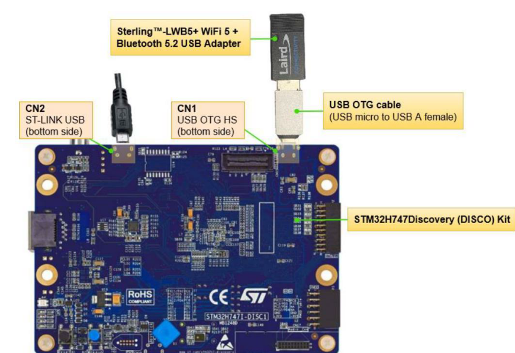](images/1-hw-setup.png)

# STM32CubeMx: Install STM32 Expansion Pack v1.6.0

The expansion pack consists of embedded software packages that complement STM32Cube MCU packages with additional software bricks provided by Infineon. To proceed, launch STM32CubeMx and then click on **Install/Remove** under the section labeled as **Manage Software Installation**.

[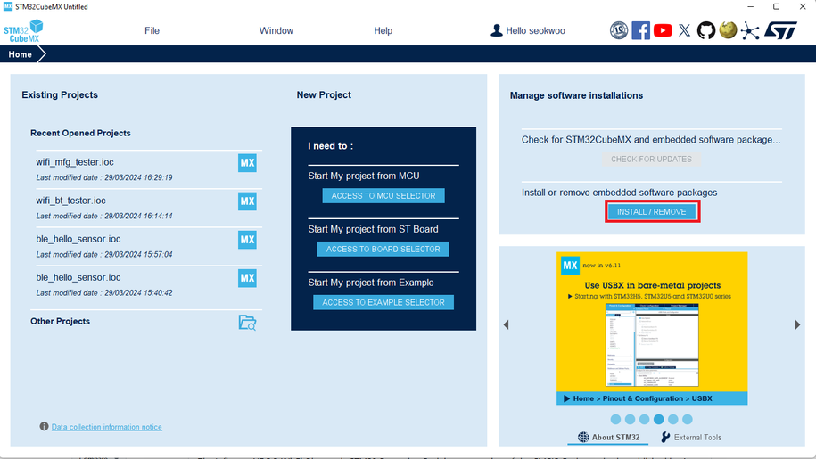](images/2-mx-overview.png)

Click on "**From Local**" and locate the "**v1.6.0 pack file**". Once you've found it, make sure to select the box for it and proceed with installing the package.

[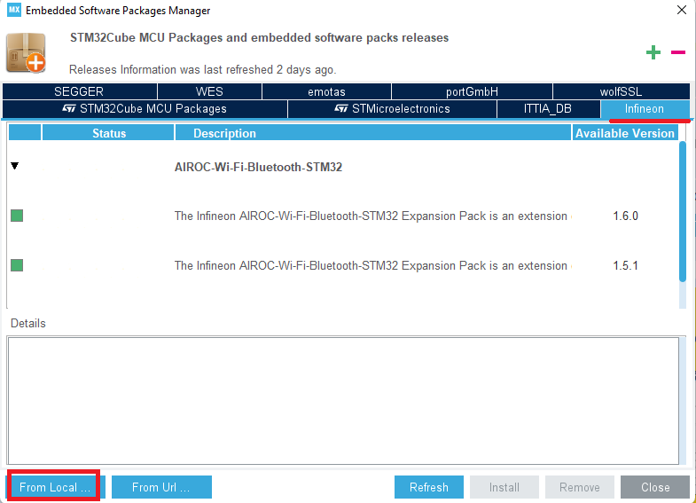](images/3-mx-install-pack.png)

Close STM32CubeMx.

# Open/build/flash application for wifi_scan with UART output

## Open a project

The .ioc file serves as a repository for initialization settings, enabling the configuration of parameters and the generation of C code. To begin, move the stm32_segger_usb.1.6.0 folder to C:\ and access wifi_scan.ioc at this location: C:\wifi-sacn-uart\stm32_segger_usb.1.6.0\Projects\STM32H747I-DISCO\Applications\4373_USB\wifi_scan.

If you encounter a pop-up indicating that your CubeMx version is newer than the one used to create the .ioc file, you will have two options:

- "Migrate" allows you to utilize a more recent version of STM32xxx firmware.

- "Continue" enables you to retain the original version of STM32xxx firmware.

Typically, updates to the STM32 chip's firmware do not affect Wi-Fi/BT application functionality significantly. In this scenario, it is recommended to select "Migrate."

[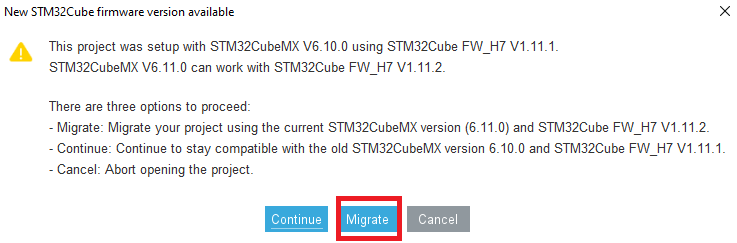](images/4-new-firmware-available.png)

Under **Pinout & Configuration**, organize the list in alphabetical order (**A->Z**). Then, select **FREERTOS_M7** > **Advanced settings** and modify **USE_NEWLIB_REENTRANT to Enable**.

[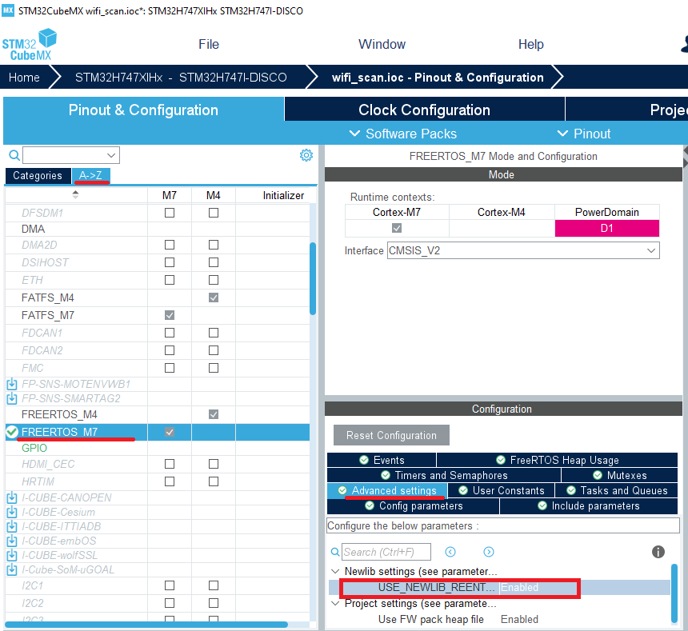](images/5-USE_NEWLIB_REENTRANT.png)

Generate Code.

[](images/6-generate-code.png)

The following error may occur but it can be ignored.

[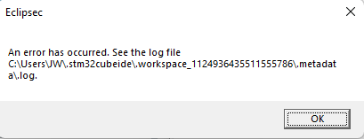](images/7-error.png)

Open project.

[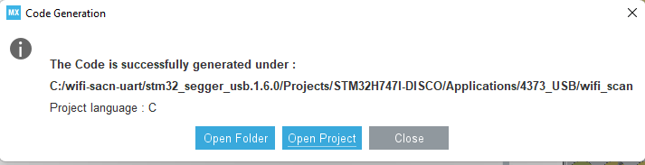](images/8-open-project.png)

Select default directory as workspace and **Launch**.

[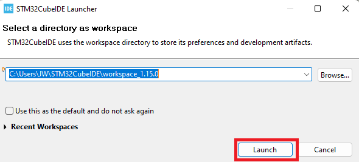](images/9-select-workspace.png)

STM32CubeIDE will import the project 'wifi_scan' into the workspace.

## STM32CubeIDE: Build Project

**Project> Build All**.

[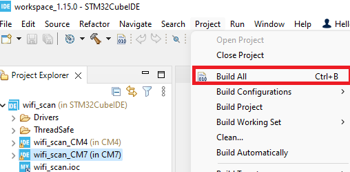](images/10-build-all.png)

.elf file should be generated after build.

[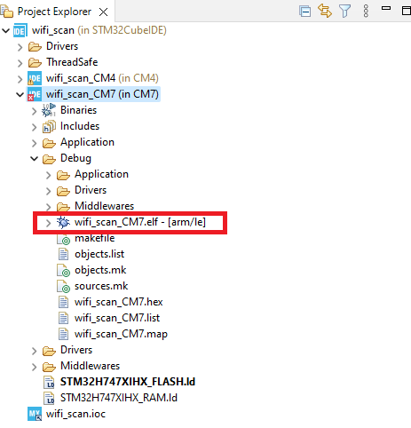](images/11-elf.png)


## STM32CubeIDE: Flash Image (.elf file) to Target Board

Plug in STM32H747I-DISCO to PC and check if it is recognized as **STLINK Virtual COM port** in device manager.

[](images/12-device-manager.png)

Flash by following the below instruction in order.

[](images/13-flash.png)

## Test wifi_scan application with Teraterm

Configure serial port and new-line receive to **AUTO**.

[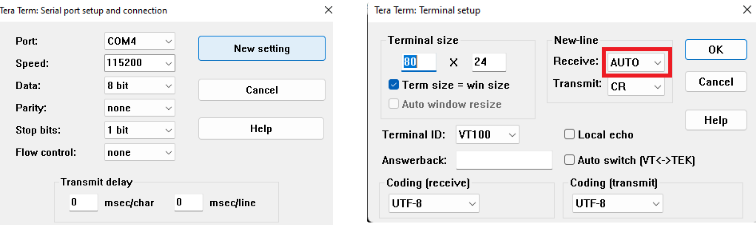](images/14-teraterm-setup.png)

Power cycle the board and it will initialize Wi-Fi module and start Wi-Fi networks.

[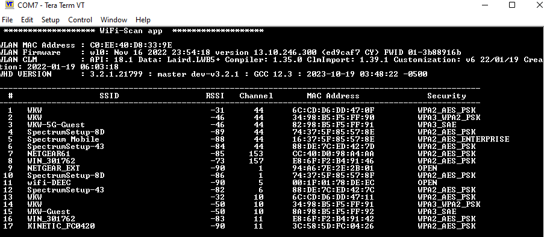](images/15-teraterm-output.png)

# Modify wifi_scan app to display result on LCD.

Remove any existing project from STM32CubeIDE from previous session.

## STM32CubeMx: Change Configuration

Create a new folder under C:\ after extracting the downloaded [stm32_segger_usb.1.6.0.zip](download/stm32_segger_usb.1.6.0.zip) and renaming the folder to, for example ```stm32_segger_usb1.6.0_lc```.

In order to ensure that all necessary files are added to Drivers/STM32H7xx_HAL_Driver/Src, open **wifi_scan.ioc** and navigate to **ProjectManager > Code Generator**. Then, verify that "**Copy all used libraries into the project folder**" is checked. After doing so, proceed to generate code on STM32CubeMX first.

[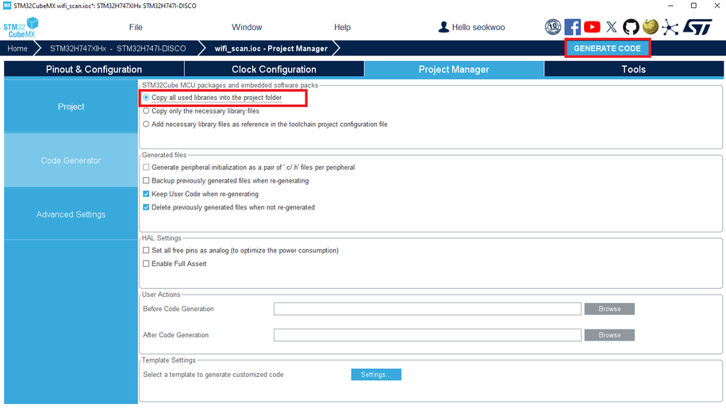](images/16-mx-project-manager.png)

To add the directories (Drivers, Utilities) under the specified wifi_scan directories using File Explorer, follow these steps. If the path does not exist, create the folder. For example, create ...wifi_scan\Drivers\**BSP\Components** and copy **Common** directory into it as shown in the first line below.
```
C:\Users\%USERNAME%\STM32Cube\Repository\STM32Cube_FW_H7_V1.11.2\Drivers\BSP\Components\Common

C:\Users\%USERNAME%\STM32Cube\Repository\STM32Cube_FW_H7_V1.11.2\Drivers\BSP\Components\adv7533

C:\Users\%USERNAME%\STM32Cube\Repository\STM32Cube_FW_H7_V1.11.2\Drivers\BSP\Components\is42s32800j

C:\Users\%USERNAME%\STM32Cube\Repository\STM32Cube_FW_H7_V1.11.2\Drivers\BSP\Components\nt35510

C:\Users\%USERNAME%\STM32Cube\Repository\STM32Cube_FW_H7_V1.11.2\Drivers\BSP\Components\otm8009a

C:\Users\%USERNAME%\STM32Cube\Repository\STM32Cube_FW_H7_V1.11.2\Drivers\BSP\STM32H747I-DISCO

C:\Users\%USERNAME%\STM32Cube\Repository\STM32Cube_FW_H7_V1.11.2\Utilities\Fonts

C:\Users\%USERNAME%\STM32Cube\Repository\STM32Cube_FW_H7_V1.11.2\Utilities\lcd

C:\Users\%USERNAME%\STM32Cube\Repository\STM32Cube_FW_H7_V1.11.2\Utilities\Lcd_Trace
```

Directory structure should look like this:

[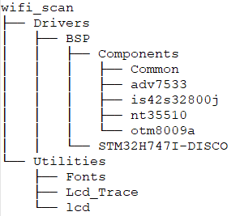](images/17-directory-structure.png)

Add the following conf files from "C:\Users\%USERNAME%\STM32Cube\Repository\STM32Cube_FW_H7_V1.11.2\Projects\STM32H747I-DISCO\Applications\USB_Host\HID_Standalone\CM7\Inc" to **wifi_scan\CM7\Core\Inc**.

- is42s32800j_conf.h

- stm32h747i_discovery_conf.h

- utilities_conf.h

Edit **utilities_conf.h** to use full screen
```
 #define     YWINDOW_SIZE                         34U
```

Modify **CM7/Core/Inc/stm32h7xx_hal_conf.h** Enable the following 4 HAL by uncommenting them.

```
#define HAL_DMA2D_MODULE_ENABLED

#define HAL_SDRAM_MODULE_ENABLED

#define HAL_LTDC_MODULE_ENABLED

#define HAL_DSI_MODULE_ENABLED
```

Modify **CM7/Core/Inc/main.h** by adding the following header files to USER CODE.

```
/* USER CODE BEGIN Includes */

#include "stm32h747i_discovery.h"

#include "stm32h747i_discovery_bus.h"

#include "stm32_lcd.h"

#include "lcd_trace.h"

#include "utilities_conf.h"

/* USER CODE END Includes */
```

Modify **CM7/Core/Src/main.c** by adding the following codes.

(1) add LCD_Init() to USER CODE.

```
/* USER CODE BEGIN PFP */

static void LCD_Init();

/* USER CODE END PFP */

(...)

int main(void)

{

(...)

  /* USER CODE BEGIN 2 */

  LCD_Init();

  /* USER CODE END 2 */

(...)

/* USER CODE BEGIN 4 */

static void LCD_Init()

{

        /* Initialize the LCD */

        BSP_LCD_Init(0,LCD_ORIENTATION_LANDSCAPE);

        UTIL_LCD_SetFuncDriver(&LCD_Driver);

        /* Initialize the LCD Log module */

        UTIL_LCD_TRACE_Init();

        UTIL_LCD_TRACE_SetHeader( (uint8_t*)"Infineon AIROC Wi-Fi Scan");

}

/* USER CODE END 4 */
```

(2) Disable the definition of __io_putchar since UART is not used for printf. 

```
/* Private user code ---------------------------------------------------------*/

/* USER CODE BEGIN 0 */

#if 0  // Disable __io_putchar

#ifdef __GNUC__

    /* With GCC/RAISONANCE, small printf (option LD Linker->Libraries->Small printf

       set to 'Yes') calls __io_putchar() */

    /***************************************************************************

    * Function Name: __io_putchar (GCC)

    ***************************************************************************/  

    int __io_putchar(int ch)

    {

      HAL_UART_Transmit(&huart1, (uint8_t *)&ch, 1, 0xFFFF);

      return ch;

    }

(...)

#elif defined (__ICCARM__) /* IAR */

(...)

#endif /* __GNUC__ */

#endif  // Disable __io_putchar
```

Include the below path to the Project by following the steps below.

```
../../Drivers/BSP/Components/Common

../../Drivers/BSP/STM32H747I-DISCO

../../Utilities/lcd

../../Utilities/Lcd_Trace

../../Utilities/Fonts
```

steps:

1. Right click on wifi_scan_CM7 in Project Explorer and click Properties.

2. Go to **C/C++ General** > **Paths and Symbols**

3. **Add** path.

4. Apply and Close

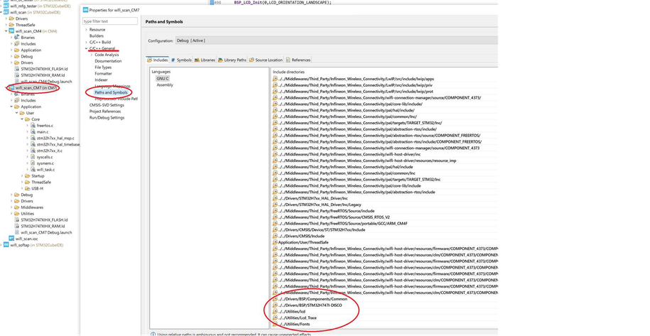

Add the following build macro using the steps below.

```
USE_STM32H747I_DISCO
```

steps:

1. Right click on wifi_scan_CM7 in Project Explorer and click Properties.

2. Go to **C/C++ Build** > **Settings** and **MCU GCC Compiler** > **Preprocessor** under Tool Settings

3. **Add** macro with + button.

4. Apply and Close

[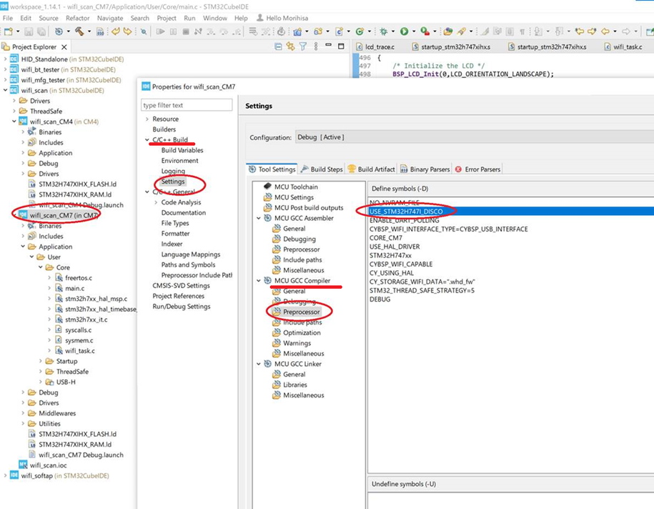](images/19-macro-USE_STM32H747I_DISCO.png)

Add the following source code to project by following the steps below.

```
Drivers/BSP/Components

../../Drivers/BSP/Components/nt35510/nt35510.c

../../Drivers/BSP/Components/nt35510/nt35510_reg.c

../../Drivers/BSP/Components/otm8009a/otm8009a.c

../../Drivers/BSP/Components/otm8009a/otm8009a_reg.c

../../Drivers/BSP/Components/is42s32800j/is42s32800j.c

Drivers/BSP/STM32H747I-DISCO

../../Drivers/BSP/STM32H747I-DISCO/stm32h747i_discovery_lcd.c

../../Drivers/BSP/STM32H747I-DISCO/stm32h747i_discovery_bus.c

../../Drivers/BSP/STM32H747I-DISCO/stm32h747i_discovery_sdram.c

Drivers/STM32H7xx_HAL_Driver

../../Drivers/STM32H7xx_HAL_Driver/Src/stm32h7xx_hal_dma2d.c

../../Drivers/STM32H7xx_HAL_Driver/Src/stm32h7xx_hal_dsi.c

../../Drivers/STM32H7xx_HAL_Driver/Src/stm32h7xx_hal_ltdc.c

../../Drivers/STM32H7xx_HAL_Driver/Src/stm32h7xx_hal_ltdc_ex.c

../../Drivers/STM32H7xx_HAL_Driver/Src/stm32h7xx_hal_sdram.c

../../Drivers/STM32H7xx_HAL_Driver/Src/stm32h7xx_ll_fmc.c

Utilities

../../Utilities/lcd/stm32_lcd.c

../../Utilities/Lcd_Trace/lcd_trace.c
```

steps:

1. Right click parent folder (e.g. wifi_scan_CM7 in the case of creating Utilities folder)

2. Select New

3. Select Folder

4. type folder name (e.g. Utilities)

5. Repeat the steps above to create other folders. These three structure should be created at the end.

	- Drivers\BSP\Components

	- Drivers\BSP\STM32H747I-DISCO

	- Utilities

[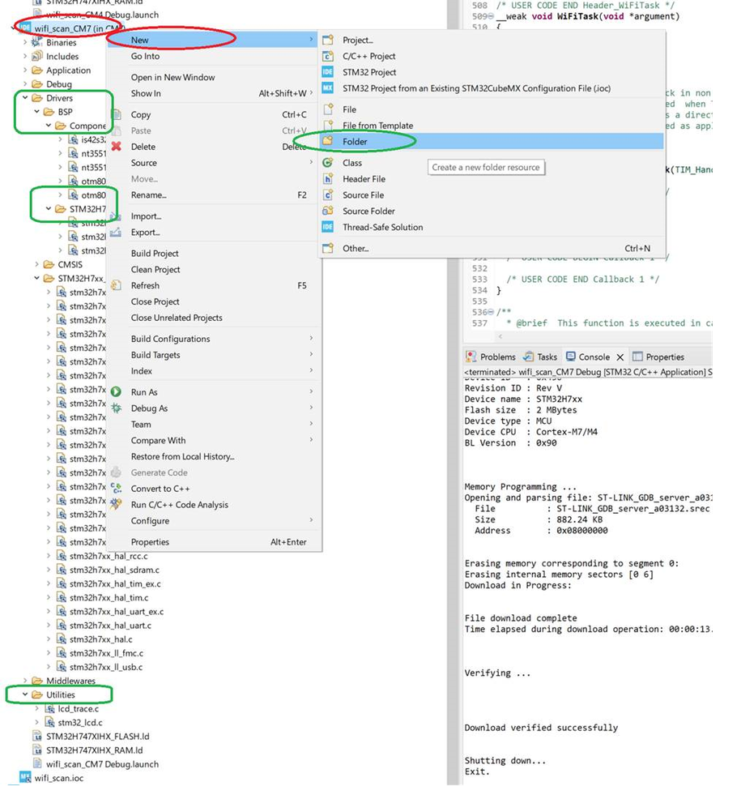](images/20-add-folder.png)

Then, add the files to folders by doing a right click on the folder where you want to add files to and clicking **New** > **File**.

[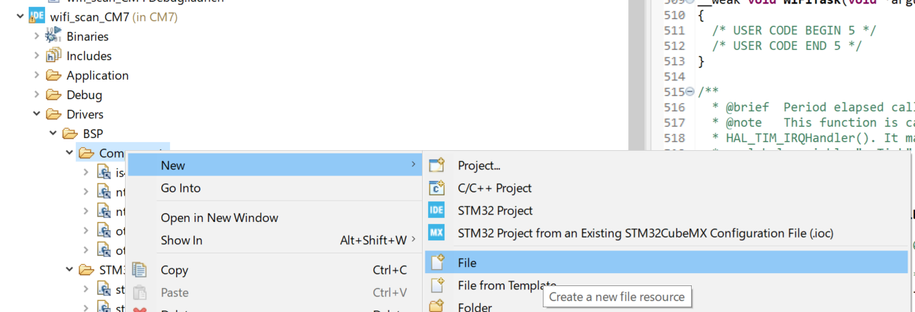](images/21-add-file.png)

Then, Check "Advanced"

- Check "Link to file in the file system".

- Then, put relative path to file like ../../Drivers/BSP/Components/nt35510/nt35510.c.

[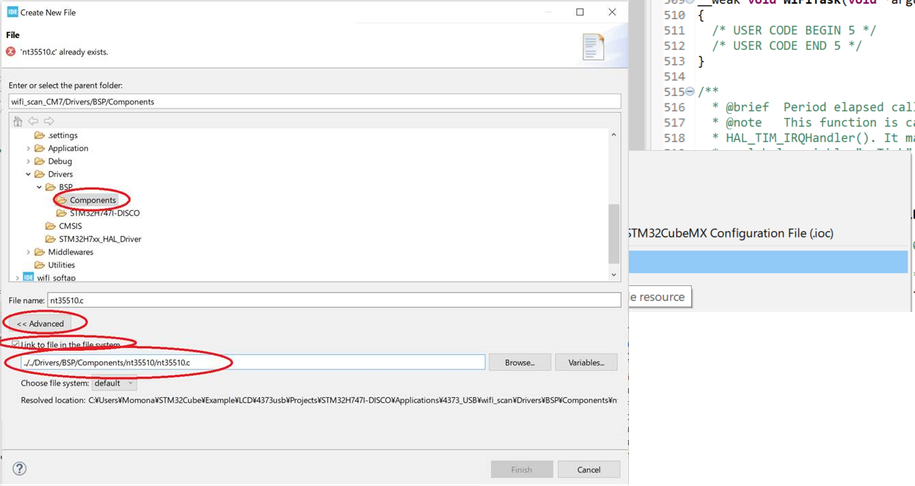](images/22-link-to-file.png)

## STM32CubeIDE: Build project

**Project> Build All**.

[](images/23-build-all.png)

.elf file should be generated after build.

[](images/24-elf.png)


## STM32CubeIDE: Flash Image (.elf file) to Target Board

Plug in STM32H747I-DISCO to PC and check if it is recognized as **STLINK Virtual COM port** in device manager.

[](images/25-device-manager.png)

Flash by following the below instruction in order.

[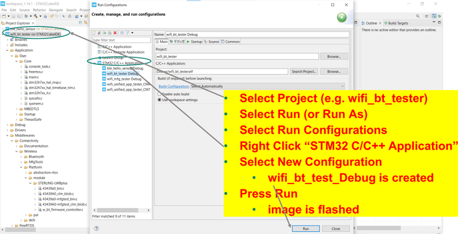](images/26-flash.png)

The application should run on the LCD.

[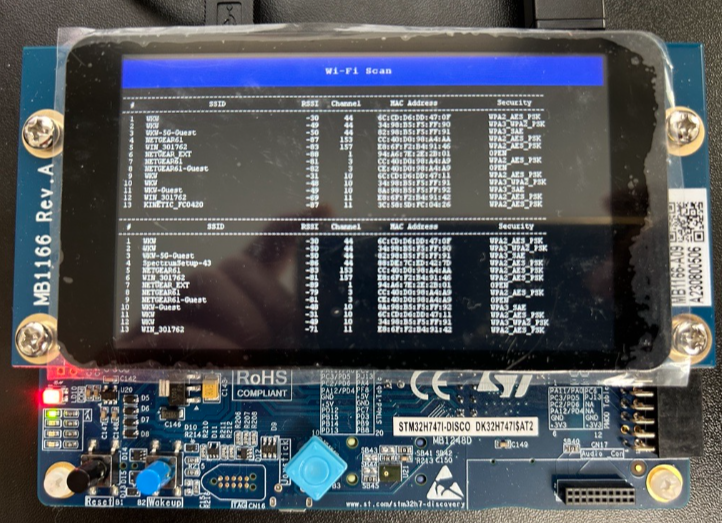](images/27-lcd-output.png)